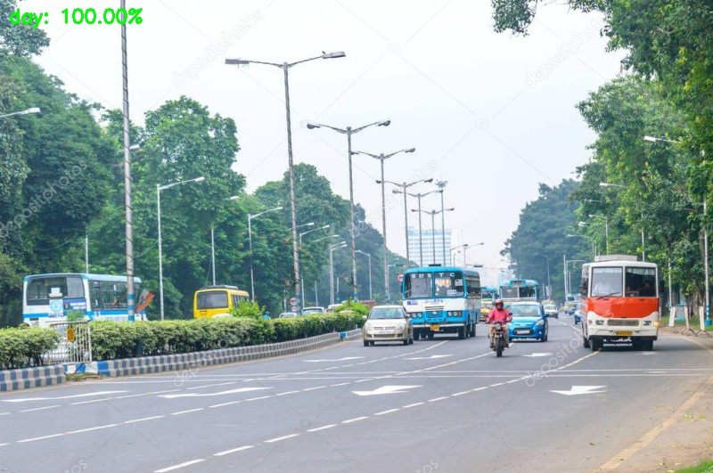

## Day-Night Classification


Train a model to classify Day / Night images using keras.

Read full article here https://medium.com/@mneonizer/day-night-classification-a01a7d9af695

**Requirements**

````
pip install -r Requirements.txt
````

**Training**

````
python train_model.py --dataset images --model model/day_night.hd5
````

Images directory contains 2 sub-directories

````
├── images
│   ├── day
│   │   ├── 00001.jpg
│   │   ├── 00002.jpg
│   │   ├── 00003.jpg
│   │   ├── xxxxx.jpg
│   ├── night
│   │   ├── 00001.jpg
│   │   ├── 00002.jpg
│   │   ├── 00003.jpg
│   │   ├── xxxxx.jpg
````

And the model is trained to classify these two labels: ``day / night``.

**Testing**

````
python test_model.py --model model/day_night.hd5 --image test/n2.jpg
````


````
python test_model.py --model model/day_night.hd5 --image test/d1.jpg
````



> Reference: https://www.pyimagesearch.com/2017/12/11/image-classification-with-keras-and-deep-learning/
